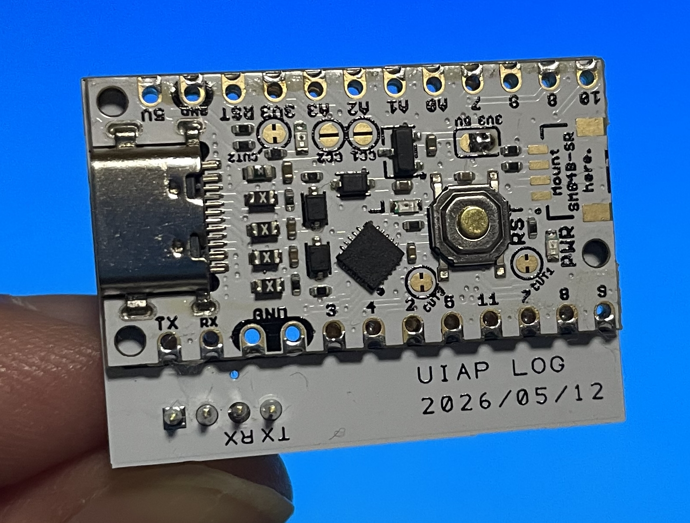

# SDLog for UIAPduino

UIAPduino (CH32V003) 用の OpenLog 互換 UART データロガーです。UART RX で受信したデータを microSD カードに記録します。 / An OpenLog-compatible UART data logger for UIAPduino (CH32V003). It receives data on UART RX and writes it to a microSD card.

このスケッチは **UIAP LOG** 基板で開発しましたが、UIAPduino と市販の microSD カードアダプタがあれば使えます。 / This sketch was developed with the **UIAP LOG** board, but it works with any UIAPduino and a standard microSD card adapter.

 

> X にて公開 / Posted on X: https://x.com/momoonga/status/2057563370535223761

# Status / ステータス

- UIAP LOG 基板（UIAPduino Pro Micro CH32V003）で実機動作確認済みです。 / Confirmed working on the UIAP LOG board (UIAPduino Pro Micro CH32V003).
- SD ドライバは [SDmin](https://github.com/tarosay/arduino_core_ch32/blob/main/libraries/SDmin/SDmin.h) v1.2.5（FAT32 LFN + サブディレクトリ対応の最小実装）を使用しています。 / Uses [SDmin](https://github.com/tarosay/arduino_core_ch32/blob/main/libraries/SDmin/SDmin.h) v1.2.5, a minimal FAT32 driver with LFN and subdirectory support.
- Flash 使用量 / Flash usage: 11592 / 16384 bytes (70%)
- RAM 使用量 / RAM usage: 1192 / 2048 bytes (58%)

# Circuit / 回路

> ⚠️ **重要**: microSD カードは 3.3V 動作です。使用前に UIAPduino の電源を 5V から 3.3V にパターンカットで切り替えてください。5V のまま接続すると SD カードが破損します。 / **Important**: The microSD card operates at 3.3V. Cut the power pattern on UIAPduino to switch from 5V to 3.3V before use. Connecting at 5V may damage the SD card.


| UIAPduino | microSD アダプタ / adapter |
|-----------|----------------|
| A2 (PC4, pin 6) | CS (DAT3) |
| 8 (PC6) | MOSI (CMD / DI) |
| 7 (PC5) | SCK (CLK) |
| 9 (PC7) | MISO (DAT0 / DO) |
| 3V3 | VDD |
| GND | VSS |

**UART（データ入力） / UART (data input):**

- `RX PD6` — ログ対象機器の TX に接続 / connect to TX of the device to be logged
- `TX PD5` — ロギングには使用しない / not used for logging

# Program / プログラム

[SDLog/SDLog.ino](SDLog/SDLog.ino) が完全なコードです。 / [SDLog/SDLog.ino](SDLog/SDLog.ino) is the full code.

- 開発リポジトリ / Development repository: https://github.com/tarosay/sdlog_uiapduino

## ビルド環境 / Build environment

このスケッチは **UIAPduino HID** ボードパッケージに最適化されており、CH32V003 の 16 KB Flash に収まるサイズのバイナリを生成できます。 / This sketch is optimized for the **UIAPduino HID** board package, which produces binaries small enough to fit in the CH32V003's 16 KB Flash.

1. Arduino IDE を開き、**ファイル > 環境設定** を開く / Open Arduino IDE and go to **File > Preferences**
2. 「追加のボードマネージャのURL」に以下を追加 / Add the following URL to **Additional boards manager URLs**:
   ```
   https://github.com/tarosay/board_manager_files/raw/main/package_uiap_hid_index.json
   ```
3. **ツール > ボード > ボードマネージャ** を開き、`UIAPduino` で検索して **UIAPduino HID** をインストール / Open **Tools > Board > Boards Manager**, search for `UIAPduino`, and install **UIAPduino HID**

| 設定 / Setting | 値 / Value |
|------|-----|
| ボード / Board | `ツール > ボード > UIAP_HID > HID ProMicro CH32V003` |
| USB | `ツール > USB > No USB (SD log / UART only)` |
| FQBN | `UIAP_HID:ch32v:CH32V003:usb=nousb,opt=oslto` |

## 使い方 / Usage

### ログファイル / Log files

電源投入ごとに新しいログファイルが作成されます / A new log file is created on every power cycle:
`LOG00001.TXT`, `LOG00002.TXT`, ...

### ボーレート（CONFIG.TXT） / Baud rate (CONFIG.TXT)

SD カードに `CONFIG.TXT` を置くとボーレートを設定できます。形式: `9600,26,3,0`（先頭の値のみ使用） / Place `CONFIG.TXT` on the SD card to set the baud rate. Format: `9600,26,3,0` (only the first value is used).

ファイルが存在しない場合は 9600 bps で動作し、`CONFIG.TXT` が自動作成されます。300 bps 以上のボーレートを指定できます。 / If the file does not exist, 9600 bps is used and `CONFIG.TXT` is created automatically. Baud rates of 300 bps or higher can be specified.

### LED 動作 / LED behavior

| LED | 意味 / Meaning |
|-----|------|
| 高速点滅 / Fast blink | エラー（SD 初期化失敗、ログファイル作成不可など） / Error (SD init failed, cannot create log file, etc.) |
| 点滅 / Blink | SD へのデータ書き込み中 / Writing data to SD |
| 点灯または消灯 / Steady | データ待機中 / Waiting for data |
