# OADG 109A(JIS配列)互換40%分割キーボード

工作する人向け(主に自分向け)に作りました。一般的な分割キーボードは左右を有線ケーブルで繋げ、PCへ接続されるUSBコネクタは中央付近にあります。せっかく分割するなら分割した空間を工作に利用したいと考え、左右を繋げず、USBコネクタを左右端にしました。

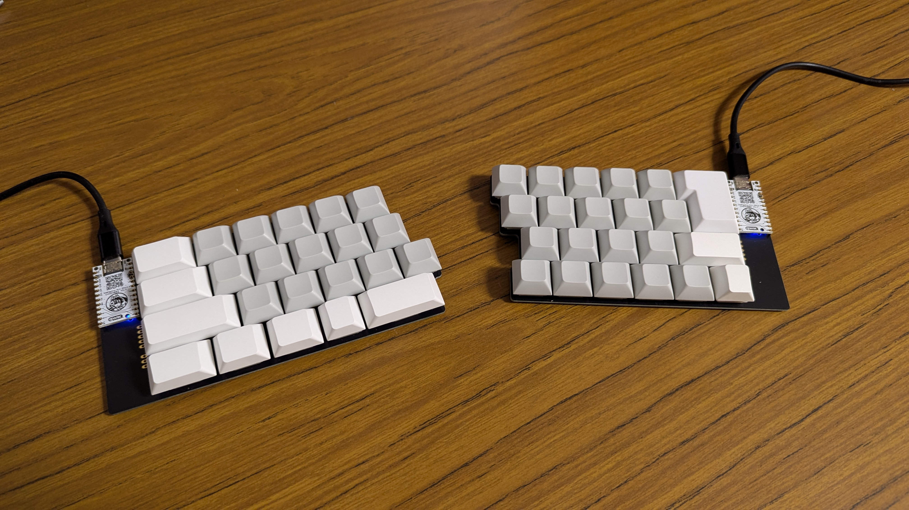 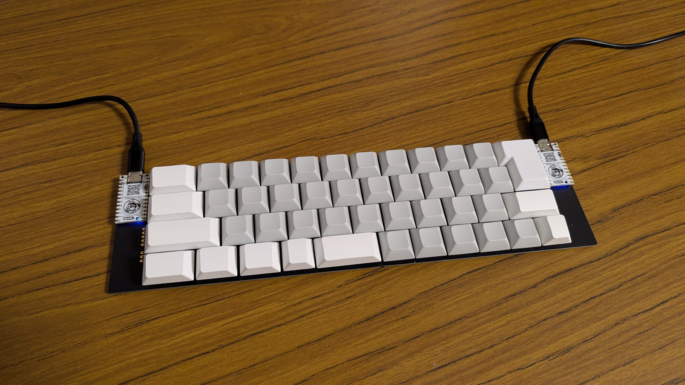 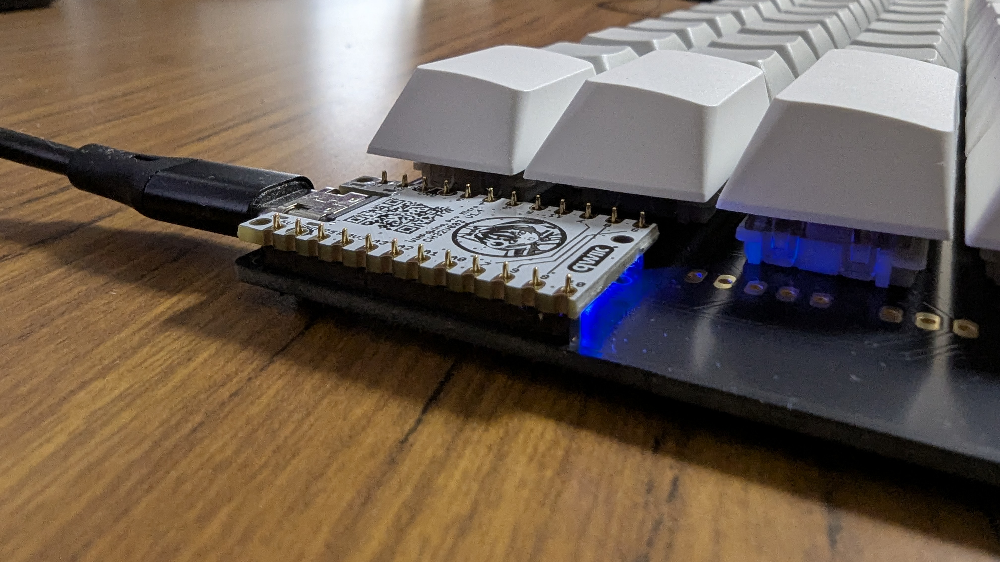

# Status / ステータス

- バージョン1.1です。
- Windows 10/11、Ubuntu 22.04/24.04で動作確認できています。
- コストはおよそ10,000~15,000円/セットです。
- 不具合はなく、完成度は及第点ぐらいです。

# Circuit / 回路

[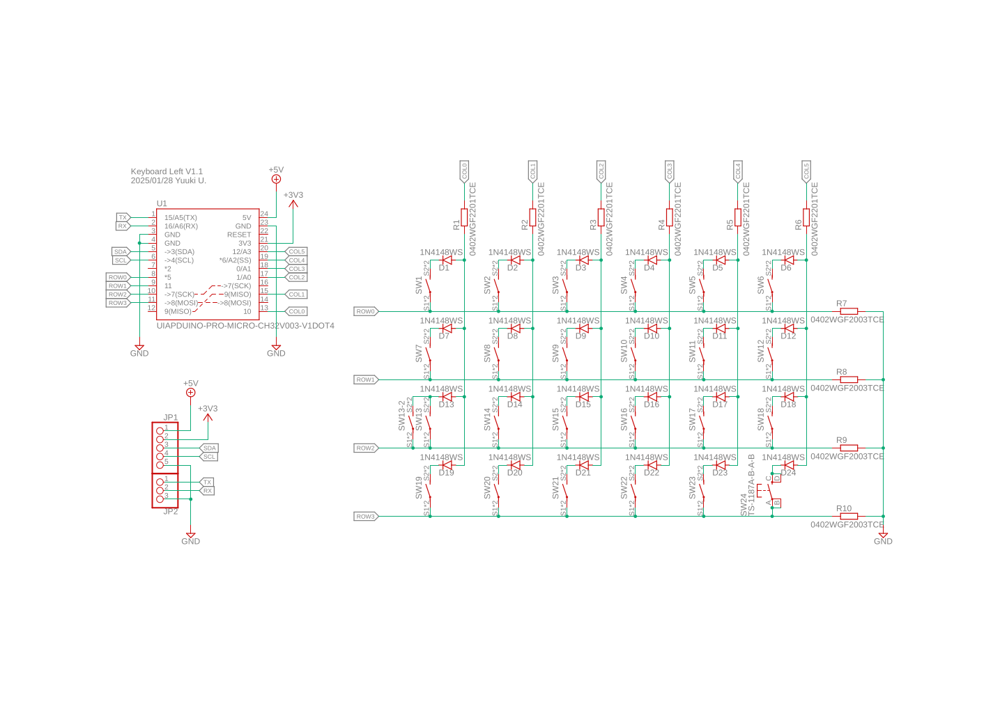](.src/doc/left.pdf) [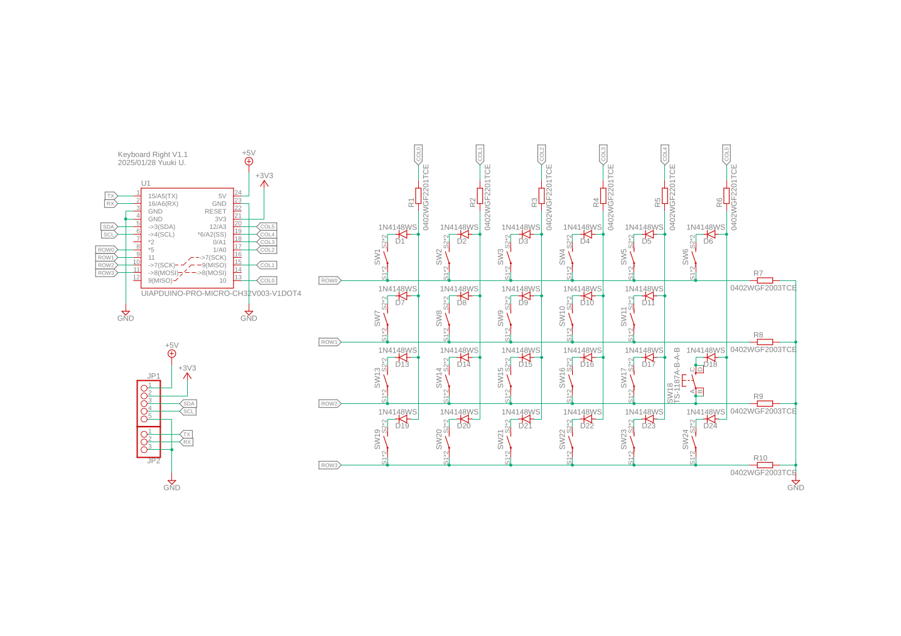](.src/doc/right.pdf)  
[設計データ(Eagle)とガーバデータ(JLCPCB)](.src/doc/Keyboard-V1.1.zip)

## 部品購入先

- https://www.switch-science.com/products/9914
- https://www.switch-science.com/products/3763?variant=42381993312454
- https://shop.yushakobo.jp/products/7050?variant=46450806882535
- https://shop.yushakobo.jp/products/dsa-blank-keycaps?variant=37665598603425
- https://shop.yushakobo.jp/products/10263?variant=50496233799911
- https://web.archive.org/web/20250325213206/https://talpkeyboard.net/items/5f9428f99a06e5313541cda7
- https://www.marutsu.co.jp/pc/i/833930/

# Program / プログラム

- リポジトリ: https://github.com/YuukiUmeta-UIAP/rv003usb/tree/custom/main/demo_pikokey_hid
- 前提環境：あらかじめ「最新のオリジナルch32fun開発環境ではじめる」でLチカまでしておきます。ビルド済みのバイナリファイルを書き込むだけ(ビルドしない)なら、Windowsなら[minichlink.exe](https://github.com/cnlohr/ch32fun/blob/master/minichlink/minichlink.exe)をダウンロードするだけでOKです。  
    https://www.uiap.jp/uiapduino/pro-micro/ch32v003/v1dot4#with-ch32fun-development-environment

## バイナリファイルを書き込む

- 左用: [bin/pikokey_customed_for_split_keyboard_left_v1dot1_board.bin](bin/pikokey_customed_for_split_keyboard_left_v1dot1_board.bin)
- 右用: [bin/pikokey_customed_for_split_keyboard_right_v1dot1_board.bin](bin/pikokey_customed_for_split_keyboard_left_v1dot1_board.bin)

同時に2マイコンボードを書き込み待機させるとうまく書き込みできません。1ボードだけ書き込み待機させ、書き込みが終わったマイコンボードはUSBから外して下さい。

```bash
minichlink -c 0x1209b803 -w pikokey_customed_for_split_keyboard_left_v1dot1_board.bin flash // 左用の書き込み
minichlink -c 0x1209b803 -w pikokey_customed_for_split_keyboard_right_v1dot1_board.bin flash // 右用の書き込み
```

## ソースコードからビルドする

### 左キーボード

左キーボード用のバイナリをビルドします。

```bash
git clone --recurse-submodules https://github.com/YuukiUmeta-UIAP/rv003usb.git
cd rv003usb/demo_pikokey_hid
make clean
make build
```

左キーボード用のマイコンボードに書き込みます。

```bash
minichlink -c 0x1209b803 -w pikokey.bin flash
```

### 右キーボード

help_functions.hの10行目のキーボード定義を2にします。1が左用で、2が右用です。

```h
// Set number from belows
// 		1: Left V1.1 board
// 		2: Right V1.1 board
#define BOARD_LORR 2
```

同じようにビルドして右キーボード用のバイナリもマイコンボードに書き込みます。

```bash
make clean
make build
minichlink -c 0x1209b803 -w pikokey.bin flash
```

> [!TIP]
> キーマップはhelp_functions.hの150行目ぐらいからあります。レイヤーの切り替えキーはHID_KEY_FNですが、キーマップに入れただけでは機能しないです。284行目付近でレイヤー切り替えキーの位置を定義すると動作します。

# 開発過程

1. [IKeJI](https://www.ikejima.org/)さんから[Let's split fes: レツプリ祭り](https://www.ikejima.org/projects/2024032-lets-split2.html)の基板をもらったので、改造して動作確認

    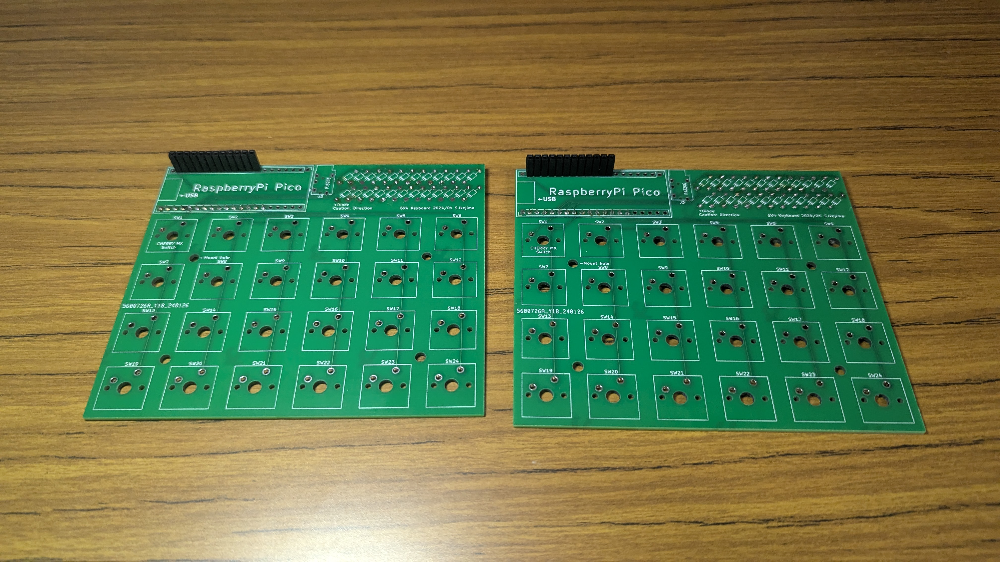 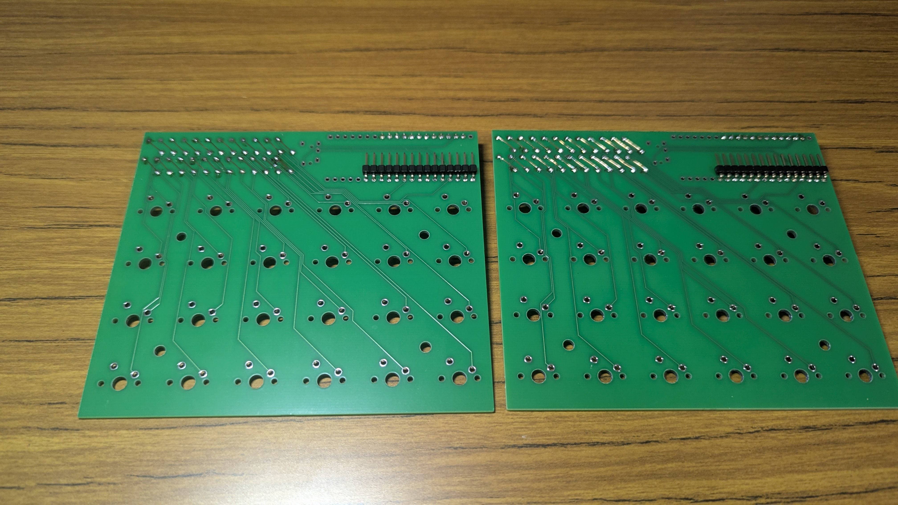 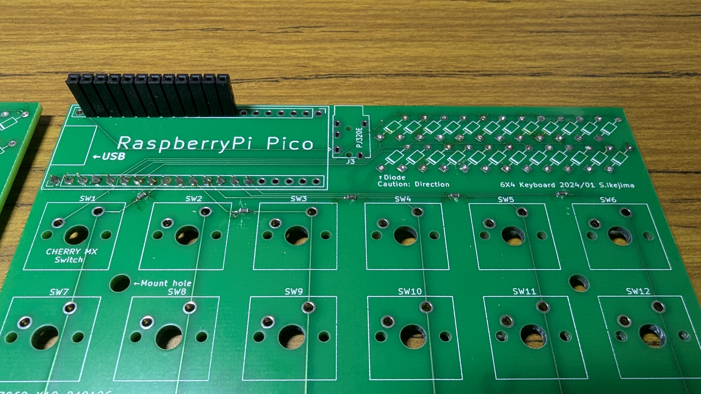  
    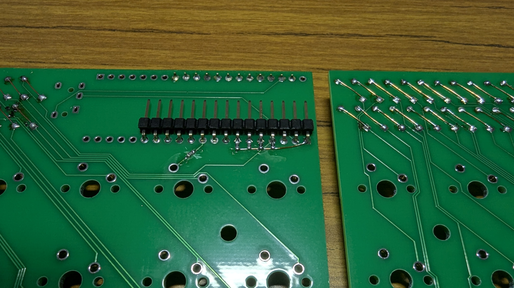 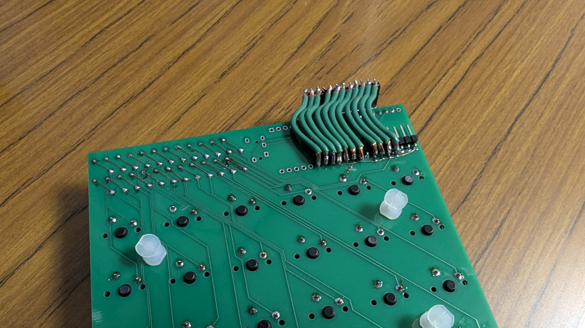 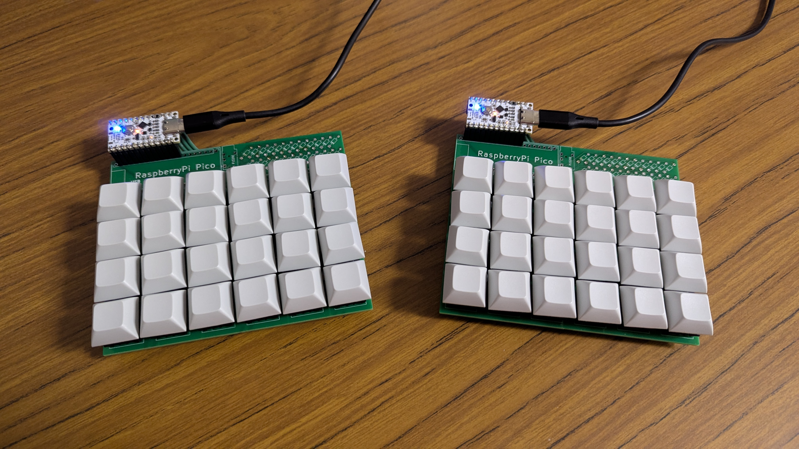  

2. [Self-Made Keyboards in Japan](https://scrapbox.io/self-made-kbds-ja/)のDiscordサーバでIKeJIさんとデバッグ

3. 動作確認できたので基板設計して[JLCPCB](https://jlcpcb.com/)に基板製造とPCBAを発注

    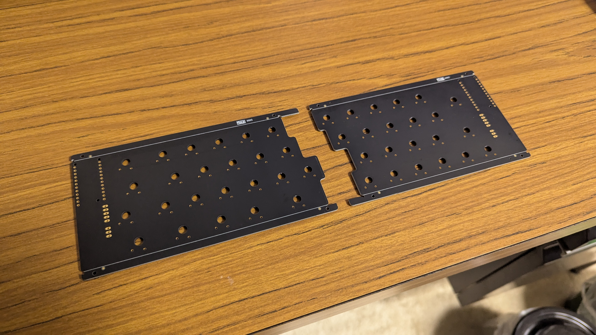 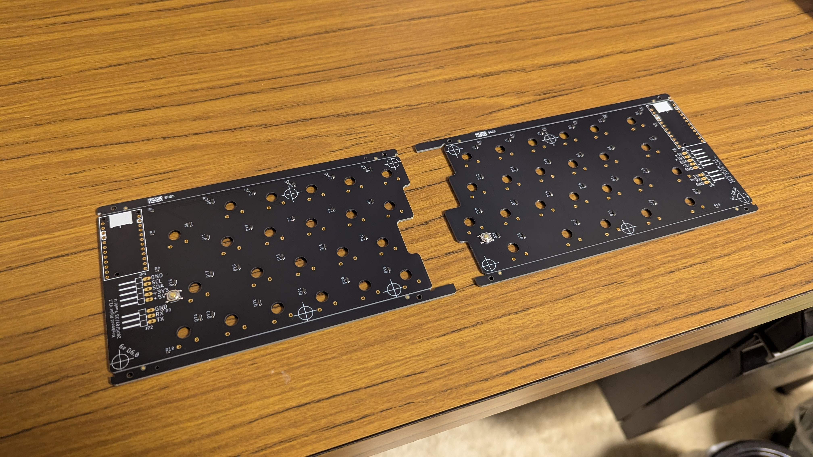

4. リード部品を はんだ して、ゴム足を付けたら完成！

    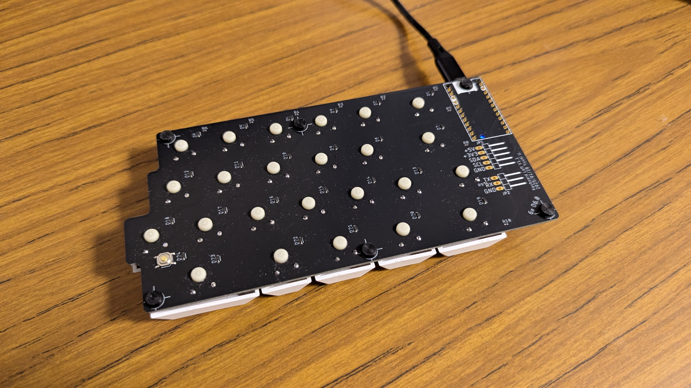 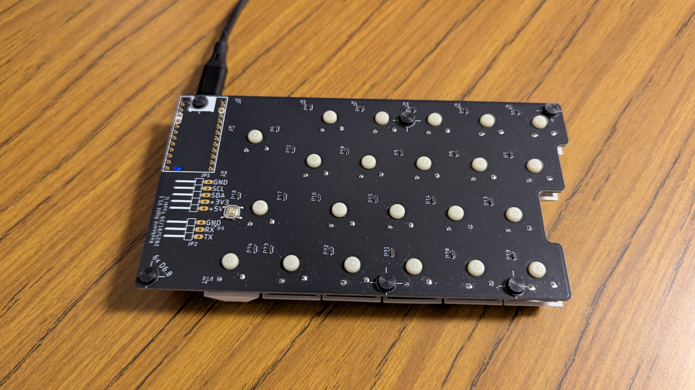

# 感想・まとめ

人に見せても恥ずかしくないキーボードになりましたが、設計者だからこそ気になる不満点があります。次の試作で改善する予定です。

- キースイッチのフットプリントがラフで、キースイッチの実装場所がバラついている点
- キースイッチ2つ使ったキーの押し込みが渋い点(バラついたままキーキャップがはめ込まれているため)
- 同時にインジケータを付けたかった点(デバッグ用の引き出しコネクタのみ)
- 左右を合わせた時にロック機構で一体キーボードになるようにすべきだった点
- せっかくなら光らせればよかったと思う点

初の自作キーボードでしたが、とても楽しく作ることができました。また、[IKeJI](https://www.ikejima.org/)さんのフォローのおかげでとても簡単に作れました。特にキーボードとして振る舞う通信部分とキーマトリクスの説明を細かくしてくれました。改めて感謝申し上げます。

# 雑記・メモ

## コンセプトは工作する人が使いやすいキーボード

- キーは19mmサイズだけどキー数が少ないのでコンパクト
- キーボードとキーボードが分かれているから分割したスペースでいじいじできる
- 分割スペースのために左右をケーブルで繋がない(やる気出たら次はLoRa通信してみる、今はそれぞれ単独)
- 分割スペースのためにコントローラは外側に配置
- 清潔感を大切にした配色

## 盛り込んだこと

- 外観は出来るだけモノトーン、製作目的はUIAPduinoを使った作例の展示用なのでUIAPduinoが一番目立つようにした
- 最低限小綺麗には作った、上面にシルクなし、つや消し黒、ENIG、手はんだはなるべくしない
- とは言え初の自作キーボードなので、分割キーボードの通信や液晶キラキラするのを試せるようにRX/TXとI2CはLピンで底面から伸ばせるようにした
- タイピング初心者なので、よくある配列にした
- ロープロファイルにした、キャップとかがちゃんと付くか不安
- フットプリントは推奨レイアウトよりタイトめにしてはんだする時のキーのズレを防止
- 手早くコスパ良く作る、展示のためなのでこだわらない(GNDやviaは考えない)

## 次の妄想

- やっぱ左右のペアリング(やる意味はおいといて)
- 左右が機械的にガッチリ合体できる
- 曲面、傾斜、扇形とか、打ちやすい形にしてく
- トラックボール一体のやつもやってみたい